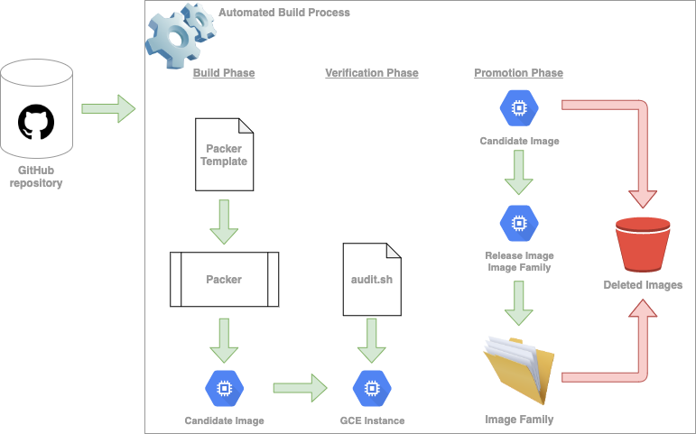

accentis-packer
===

This repository contains [Packer](https://packer.io) specifications for building Google Compute Engine (GCE) Images.  These Images are used to initialize the boot disk of GCE Instances provisioned within the Accentis Google Cloud Platform (GCP) projects.

# Format

Packer supports two formats for its specification file: **JSON** and **HCL**.  The **HCL** is used in this repository because it is more readable than the **JSON** format.

# Image Lifecycle

The complete lifecycle of a GCE Image consists of the following phases:
* candidate creation
* candidate validation
* promotion
* deprecation
* removal



The automation in this repository covers the first three phases.

## Candidate Creation

The candidate creation phase is the initial phase of an Image.  The Packer tool is used in the automated build process to produce a candidate image.

## Candidate Validation

Once a candidate image has been produced, the automated build process launches the validation routine.  This consists of launching a GCE Instance using the candidate image.  Once the instance is running, a series of verification steps are executed to determine the validity of the candidate image.

## Promotion

Candidate images that have passed all of their verification steps, are promoted to release images.  This promotion is done by adding the image to an GCE Image Family.  Image families are sets of versions of an image.  When other resources need to specify an image to use, they can instead specify an image family.  Doing so will result in the latest, non-deprecated, image version to be used.  This feature makes it possible to roll-out new image versions, without having to go and update specific image URLs in resources like GCE Instance Templates.

## Deprecation

As newer versions of an image are released, older versions are no longer needed.  Deprecating an image allows for a graceful end-of-life transition.  GCE provides three deprecation states: **DEPRECATED**, **OBSOLETE**, and **DELETED**.  These different states affect operations that try to use the image as follows:
* **DEPRECATED**: existing and new links to the image still work, but a warning is emitted
* **OBSOLETE**: existing links to the image still work; attempts to create new links to the image result in an error
* **DELETED**: existing links to the image no longer work; attempts to create new links to the image also result in an error

> *Note:* Setting an image's deprecation state to deleted does not delete the image.

## Removal

After an image has been deprecated and it is no longer used, it is permanently deleted in order to save on storage costs.

# Repository Organization

This repository is organized into:
* a Packer template file and additional files to upload into images
* a **verify** directory containing code to verify produced images
* a Justifications file

## Packer Template

The Packer template file defines all of the images produced by this repository.  It also contains the provisioners used to build those images.  A manifest file is produced at the end of each build listing the produced artifacts.

For more information about the Packer template file, refer to the [documentation section](https://packer.io/docs) of the Packer website.

## **verify** Directory

The **verify** directory contains a verification test suite, that validates a produced image against all level 1 automated CIS Ubuntu 20.04 Benchmark sections.  The benchmark document can be downloaded for free from this [website](https://learn.cisecurity.org/benchmarks) (*you will be required to provide personal information*).  The verification test suite uses a Bash script to run all of the audit commands for each section.

## Justification File

The justification file allows specifying sections exempt for a given image.  When the verification test suite detects a failure in a section that's exempt, the failure is not counted, and the section is reported as **SKIPPED** rather than **FAILED**.

### Format

```json
{
    "<build_name>": [
        {"<section_number>": "<justification_text>"}
    ]
}
```
Where **<build_name>** is the name of the corresponding source block from the Packer template and the name field in the manifest document.

For example, in the Packer template file:

```hcl
source "googlecompute" "bastion"
```

or in the manifest document:

```json
{
    "builds": [
        {
            "name": "bastion",
      "builder_type": "googlecompute",
      [ >8 SNIP ]
}
```
the **<build_name>** would be `bastion`.
